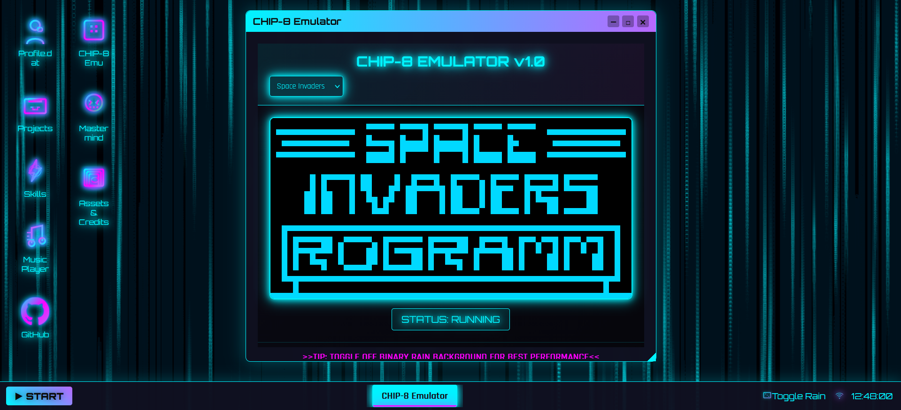

# Interactive Portfolio
A fully interactive, desktop-themed portfolio website built with vanilla JavaScript, HTML, and CSS. This project simulates a functional operating system environment with dynamic window management, persistent user settings, and integrated native program demos compiled to WebAssembly.

## Features
#### Desktop Environment
- **Fully Interactive Window Manager:** Resizable, draggable windows with z-index layering and full UI controls (minimize, maximize, close).
- **Persistent State:** User preferences (background mode) are saved across sessions.
- **Taskbar App Management:** Interactive taskbar with running app indicators and quick window restoration/minimization. The windows will maintain their position and size when minimized and restored, providing a proper desktop-like experience.
- **Pre-opened Profile Window:** Automatically launches on initial load to guide user interaction.

## Immersive UI/UX
**Dynamic Background Modes:**
- *Binary Rain:* Animated falling code with glow effects for a cyberpunk aesthetic.
- *Performance Mode:* Static gradient background (toggleable via system tray) for reduced resource usage.

**Glitch & Visual Effects:** CSS-driven glitch animations and transitions for thematic immersion.

**Responsive Design:** Adapts layout and functionality across standard desktop screen sizes.

## Integrated Applications
**Functional Music Player:** Custom-built audio player with synthwave/cyberpunk soundtracks.

**CHIP-8 Emulator (via WebAssembly):**
- A fully functional CHIP-8 emulator written in C++, compiled to WebAssembly using Emscripten.
- Real-time in-browser execution with keyboard input mapping (SDL-based key handling).

**Mastermind Game:**
- Interactive code-breaking game with custom rule support.
- Input via click or keyboard with real-time feedback.

## Tech Stack
#### Frontend
- **HTML:** Semantic markup for window structures and application containers.
- **CSS:** Flexbox/Grid layouts, CSS animations (glitch, transitions), and responsive design.
- **JavaScript:** For window management, state persistence, event handling, and dynamic UI updates.

#### Systems Integration
- **WebAssembly (Emscripten):** Used to compile C++ projects (CHIP-8 emulator) for in-browser execution.

- **C/C++:** Core emulator logic, compiled to WASM with Emscripten’s SDL bindings for I/O.

#### Build & Deployment
- **Emscripten 3.1+:** Toolchain for C/C++-to-WebAssembly compilation.
- **GitHub Pages:** Hosting for deployment.

## Implementation Details
#### Window System Architecture
- Each window is a DOM element managed by a custom WindowManager class.
- Z-index stacking is controlled via a centralized state manager to maintain focus order.
- Drag-and-drop implemented using mousedown/mousemove/mouseup listeners with boundary constraints.
- Resizing uses similar listeners with calculated CSS width/height updates.

## WebAssembly Integration
1. C++ Source Compilation using an edited Makefile to compile the code using `make wasm`, creating the WASM modules. C source compilation used a different method that involved creating a `build.sh` script to compile the code and create WASM modules.

2. WASM module is loaded asynchronously and initialized. SDL key events are mapped to HTML5 keydown/keyup listeners.

3. The compiled module runs at native speed, rendering graphics directly to a canvas element.

## Performance Optimizations
- **Binary Rain Toggle:** Animation uses requestAnimationFrame with an off switch to suspend rendering when inactive.
- **Event Delegation:** Global event listeners on the desktop container reduce individual element listeners.

## Mobile Compatibility
Updated the site to adjust to dimensions of mobile phones so that the site is viewable and compatible in browser apps. All features work except for being able to play the games on the Chip-8 Emulator. The roms are viewable and can run but require a physical keyboard to play. Simple roms such as the Chip-8-logo are able to run on mobile.

## USAGE
#### Basic Navigation
- **Open Apps:** Double-click any desktop icon.
- **Window Controls:**
    - Drag: Click and hold the title bar.
    - Resize: Hover and drag the bottom-right corner.
    - Minimize/Maximize/Close: Use buttons in the top-right corner.
- **Taskbar:** Click app icons to minimize/restore windows.

#### Background Toggle
Click the screen icon in the system tray (bottom-right) to switch between:
- Binary Rain ON: Animated falling code (immersive but resource-heavy).
- Binary Rain OFF: Static gradient wallpaper (performance mode).

#### CHIP-8 Emulator
The emulator uses a QWERTY keyboard for input. The keys are mapped below from left to right (1->1, 2->2, 3->3, C->4, etc):

QWERTY Key     | CHIP 8 Key |
----------- | ---------- |
1 2 3 4     | 1 2 3 C    |
Q W E R     | 4 5 6 D    |  
A S D F     | 7 8 9 E    |
Z X C V     | A 0 B F    |

Launch the CHIP-8 app and load a ROM via the in-app file picker.

#### Mastermind Game
- Enter guesses via on-screen number buttons or keyboard.
- Press ENTER to submit.
- Set custom game rules (secret code length, attempt count) in the settings panel.

Game rules can be found at the bottom of the window.

## Acknowledgements
Chip-8 roms were found on the following sites:
- Breakout: [Chip-8 Archive](https://johnearnest.github.io/chip8Archive/?sort=platform)
- Test roms (IBM and Chip-8 logos): [Chip-8 test suite](https://github.com/Timendus/chip8-test-suite)
- Other games were found in [this repo](https://github.com/kripod/chip8-roms)

The [astronaut character](https://floatingkites.itch.io/cute-astronaut) was created by [Fly](https://itch.io/profile/floatingkites) on Itch.io.